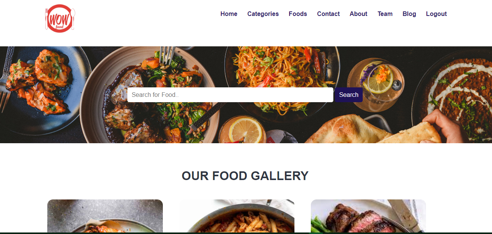
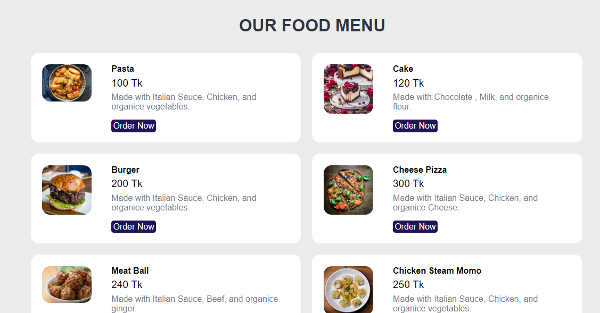
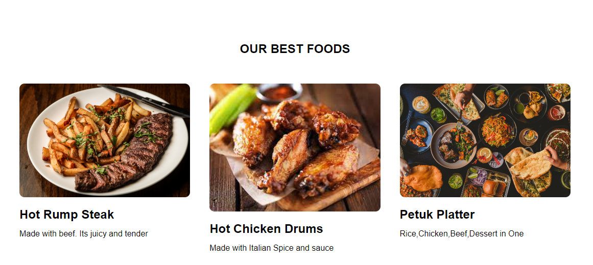
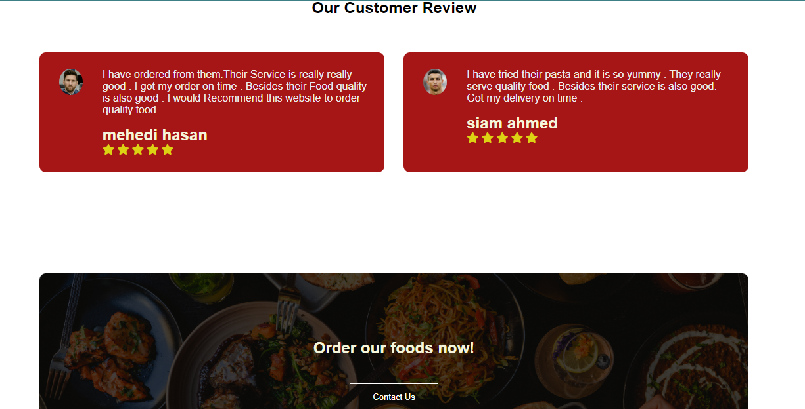
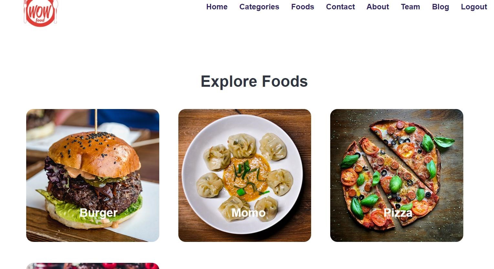
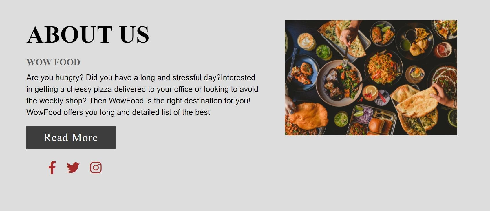
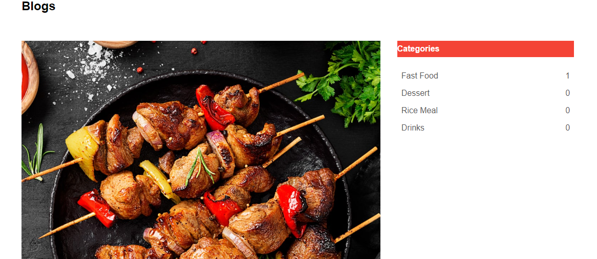
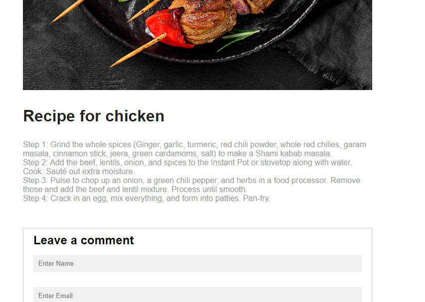
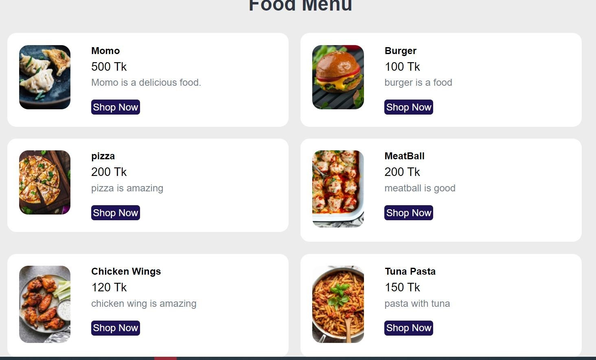

# Wowfood

An online food ordering system can be defined as Software that allows restuarent runs their business on internet . Wowfood is a website for hungry customers to view restuarent dishes And place their online order. Customer can choose their desired food using category . In this HTML , CSS are used as front-end and PHP is used as back-end. For storing data MYSQL is used as database . This website is full dynamic , all the data are feteched from database.

## Features :
* User freindly login/register system.
* There is a category option .
* There is search option . Customer can search their desired food from search .
* Customer can contact us thorugh contact page.
*  It tracks all the information of category , foods & orders.

## Software Specification
* Language - HTML, CSS for (frontend) , PHP for backend
* Database - Mysql server xampp
* Tools - VSCode

## Project Demo:
      

      

      

      

      

